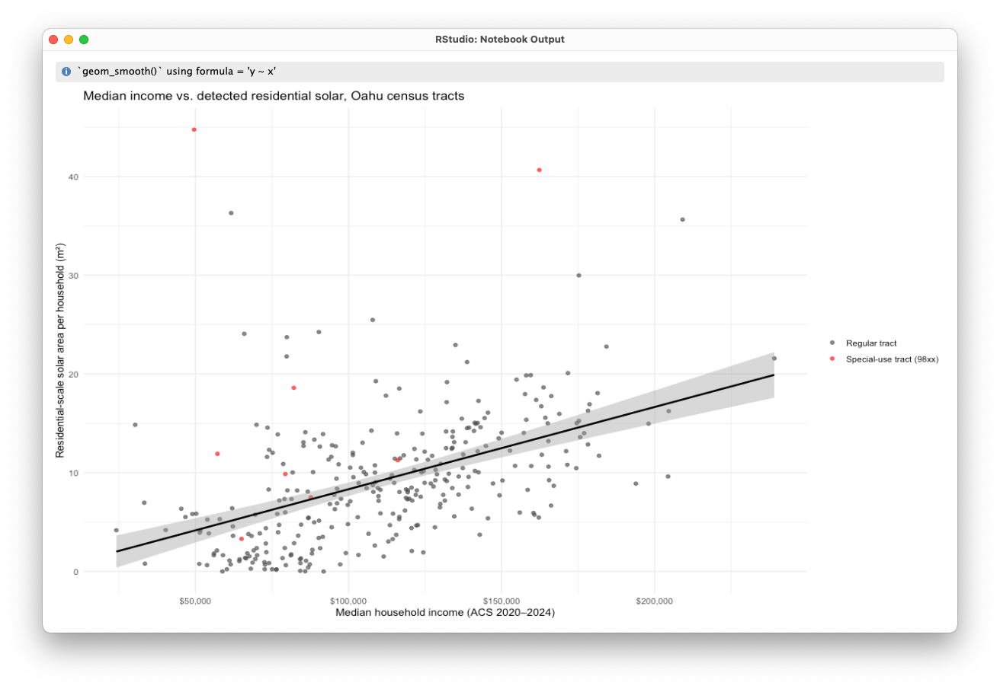
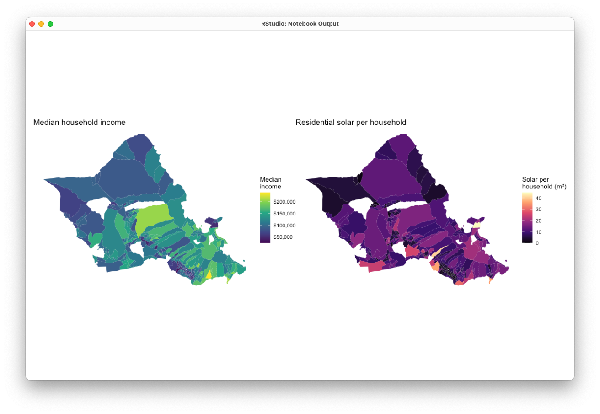

# Median Income and Residential Solar on Oahu: Methods and Results

## Methods 

I used the SAM3 solar panel detections for all of Oahu (88,663 polygons). I removed 68 empty polygons. I changed the map projection to UTM Zone 4N (EPSG:32604) so I could measure each polygon's area in square meters. I got census tract boundaries, median household income, and the number of households from the 2020–2024 American Community Survey (ACS) 5-year estimates, using the tidycensus R package. I kept the 328 tracts on Oahu.

Most polygons were small, but a few were very large (median 25 m², largest 69,199 m²). On satellite images, some solar farms showed up as a few large polygons. Others were split into many small pieces, one for each row of panels. Because of this, I could not find solar farms by looking at one polygon at a time. Instead, I added a 5 m buffer around each polygon and joined the buffers that touched. This grouped polygons within about 10 m of each other into clusters. Rooftop solar on a home is rarely larger than 200 m², so I removed clusters larger than 1,000 m² as commercial or utility-scale solar.

I placed each remaining polygon into one tract, using a point inside the polygon so that no polygon was counted twice. Then I added up the solar area in each tract. Large rural tracts can have a lot of land but few homes, so I divided solar area by the number of households. I removed tracts with no income data or fewer than 100 households, because their values are unstable. This left 314 tracts. I measured the relationship between income and solar per household with Pearson's r and Spearman's ρ. Spearman's ρ is less affected by extreme values.

## Results

Tracts with higher median income had more residential solar per household. The relationship was moderate, positive, and statistically significant (Pearson r = 0.47, 95% CI 0.38–0.55, p < 0.001; Spearman ρ = 0.58, p < 0.001) (Figure 1). Income explains about 22% of the differences in solar between tracts (r² ≈ 0.22). The spread of values grew at higher incomes, and a few lower-income tracts had a lot of solar.
 

In total, SAM3 detected 4.98 km² of solar, and 99.8% of it fell inside a tract. Large installations made up a big share. The 412 clusters I removed were only 3.5% of all polygons but 39.5% of the total solar area. If I had removed only single polygons over 1,000 m², I would have removed just 22.2%, because many solar farms were split into small pieces. Before removal, Census Tract 89.31 had 511,053 m² of solar for only 794 households (644 m² per household). This came from a solar farm, not rooftops.

On the maps, dense urban tracts in Honolulu had both lower income and less solar, while some suburban tracts had both higher income and more solar (Figure 2).

These results show a correlation, not a cause. Other things linked to income, like owning a home, living in a single-family house, or having more roof space, may also matter. The results describe tracts, not individual households. Finally, SAM3 missed some panels and made some false detections, and the ACS income values are estimates with error.